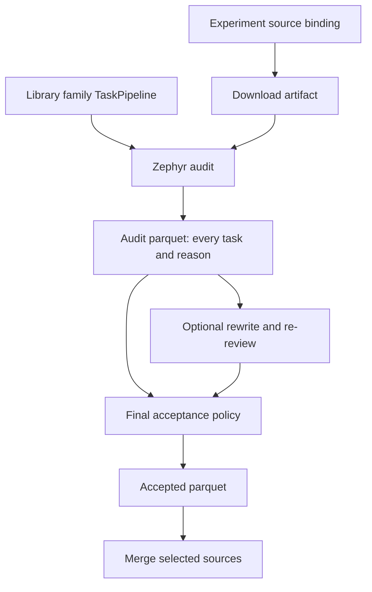
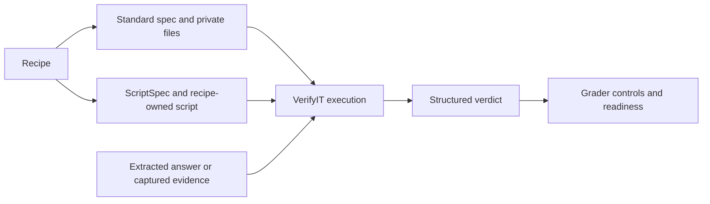

# Task curation

The task curation pipeline downloads pinned source files, normalizes their records,
checks grading contracts, asks GLM for a source-specific quality assessment, and
writes final decisions to Parquet. Every selected input remains in the audit,
including rejected tasks and failed reviews.

The artifact graph lives in
[`experiments/post_training/task_curation/pipeline.py`](https://github.com/marin-community/marin/blob/main/experiments/post_training/task_curation/pipeline.py).
Reusable readers, normalizers, checks and review logic live under
`lib/taskcompendium/src/taskcompendium/pipeline/`.

## Task contracts

Tasks use the shared TaskSpec schema. Standard exact, numeric, multiple-choice and
final-action contracts use VerifyIT candidate specs. Recipes emit standard VerifyIT specs or ordinary grading scripts with private fixtures; no TaskCompendium verifier registry is required. Unbound evaluators remain explicit in the audit. Resources use `all`, `worker`, `oracle` and `verifier` groups with
relative paths. Executable prototypes bind named tool providers and retain their
interaction-tool declarations and capture paths. Direct-chat export rejects those
execution requirements.

Artifact identity includes the TaskSpec schema version, so schema changes cannot
reuse incompatible normalized Parquet. Exact-query review caching remains scoped
to the query and model revision.

## Run a source

Plan a ten-record run without downloading data or contacting GLM:

```bash
uv run --with './lib/taskcompendium[pipeline]' python -m \
  experiments.post_training.task_curation.pipeline \
  --source math500 --limit 10 --model-revision YOUR_GLM_REVISION
```

Add `--run`, `--base-url URL` and `--review-cache PATH` to execute. Set
`GLM_BULK_TOKEN` in the execution environment. Artifact outputs use `MARIN_PREFIX`;
set it to the desired S3 prefix or a local directory. The same graph runs in either
location. Credentials are excluded from artifact configuration and fingerprints.

Repeat `--source` to select more sources. `--limit N` caps selected input records
**per source**, including records later rejected. `--all-rows` removes that cap.
Executable source controls also require `--image` with an immutable image digest.
A missing runtime binding remains explicit; static GLM acceptance does not certify
that a grader is executable.

## Stages

1. **Download.** Existing `hf_download`/`raw_download` artifact builders stage the
   declared source files at their pinned revision. Related selections share the
   download when they use the same files. Download identity is independent of N.
2. **Read and limit.** Shared readers decode the staged format and select the
   requested component. The audit uses
   `reshard(1).take_per_shard(N).reshard(64)` before normalization. On one shard,
   `take_per_shard` imposes the overall source limit. This deliberately simple
   implementation can read and reshuffle the complete source before truncation.
   A source with fewer than N records completes with those records.
3. **Audit.** Normalization preserves the public/private boundary and records
   edits or import failures. Duplicate and conflicting references are identified.
   Checks and GLM findings are recorded independently.
4. **Filter.** Policy produces a final keep/reject decision and reasons. Bad,
   conflicting, invalid or unavailable reviews do not admit tasks. Confidence
   thresholds are policy; they do not create a separate human-review queue.
5. **Optional rewrite.** Explicitly selected tasks from the filtered audit receive
   a separate repair rubric. Candidate instructions are checked and reviewed
   again before a new filtering decision. Original evidence and candidate
   lineage remain available.
6. **Merge.** Cross-source canonicalization retains all audit rows, removes exact
   duplicates from accepted views, cuts typed reference conflicts and excludes
   training records that overlap evaluation tasks.

Source provenance uses the pinned dataset, revision, component/split and original
file/record locator. It does not depend on the position in a development sample.
Decoded records that fail normalization get audit rejections. File decoding errors
fail the stage with file context.

## Source families

Sources sharing conversion and review structure belong together. The library
provides a `TaskPipeline`: a normalizer, review rubric and optional check suite.
It describes conversion policy without selecting a dataset or constructing an
artifact graph. Family factories expose meaningful schema and grading differences.

The experiment binds that policy in a `DatasetRecipe`, which declares the name,
version, source identity, intended train/eval use and `RecipeInputs`. The inputs
specify staged file selection and pinned `HubDownload` or `UrlDownload`
declarations, including auxiliary reference files.

| Location | Responsibility |
|---|---|
| `lib/taskcompendium/.../pipeline/datasets/` | Family normalizers, review criteria, controls and grader packages |
| `experiments/post_training/task_curation/nemotron.py` | Seventy-five Ultra selections, blend pins, membership and placeholder inputs |
| `experiments/post_training/task_curation/direct_sources.py` | Direct math, QA, instruction, code, preference and generated-source bindings |
| `experiments/post_training/task_curation/archive_sources.py` | TaskTrove component selections and bindings for archived task schemas |
| `experiments/post_training/task_curation/source_bindings.py` | Catalog assembly and experiment-specific converter adapters |
| `experiments/post_training/task_curation/pipeline.py` | Download, audit, optional rewrite, filter and merge artifact graph |
| `lib/taskcompendium/.../pipeline/stages.py` | Reusable Zephyr execution of the bound conversion and review policy |

For example, `nemotron_ultra/safety.py` supplies `safety.pipeline(...)`.
The experiment selects that policy for the safety component in three Ultra
blends. Math selections explicitly attach placeholder-reference downloads;
repository selections attach the SWE-Gym membership input. Adding a selection
uses the family policy without adding another converter module or a branch to
the execution engine.



Existing TaskTrove conversion adapters are supplied by the experiment. Library
policies compose them with normalization and preserve conversion edits. VerifyIT
owns generic comparisons, format validation, execution and the structured verdict
contract. Library conversion policies own source-specific scoring policy and package it as scripts
when a standard specification is insufficient. `taskcompendium.grader` builds
these packages; `taskcompendium.grading` extracts evidence and executes them.
Environment capture and isolated execution live under `taskcompendium.runtime`.
SQL and structured tool actions retain their distinct contracts.

### Grader packages

`GraderPackage` pairs a standard VerifyIT descriptor with private files. Assign its descriptor to `task.verifier` and its files to `task.resources.verifier`. File paths are relative to the private tests directory. A math normalizer can emit a `MathSpec`; a schema normalizer emits `JsonSchemaSpec` and its schema. Neither requires a new registered kind.

For custom policy, `script_package(script_bytes, config)` emits `ScriptSpec`, `grader.py` and `config.json`. The script reads `VERIFYIT_TESTS_DIR` and `VERIFYIT_WORKSPACE` and writes a structured verdict to `VERIFYIT_LOGS_DIR/verdict.json`. A script may import generic VerifyIT components or implement the comparison itself. Recipe templates live alongside the dataset families in `pipeline/datasets/grader_scripts/` and are embedded into the task; execution does not import the converter module.



Direct-chat evidence is written to `answer.txt`; captured state is written to `state.json`. Captured files under `/app` retain their relative paths; other paths appear below `captured/`. Private resources never become worker mounts. Coding tasks declare a pinned private grading image and run in a fresh network-disabled machine. This prototype does not prevent submitted programs from reading hidden tests within that grading machine.

Unbound source evaluators preserve their private contract and emit infrastructure errors. Quality filtering can keep an understandable task while the executable view excludes it. Positive and negative controls exercise the same emitted package used for grading.

The Python-test family shares conversion and privacy checks between `pymethods`
and `pymethods_large`. Its rubric entries preserve their differences: scheduling
and optimization for the former, public signatures and class state for the
latter. Their selected TaskTrove components and revisions live in the experiment.

To add a source:

- Declare its immutable release, split/component, staged file selection and
  intended use in the relevant experiment binding module. Reuse a format reader
  and archive decoder where possible.
- Bind a family `TaskPipeline`. Add a concrete extraction function in the library
  when the row schema or grading contract differs. Keep private solutions and
  tests private.
- Specify family review criteria and executable controls in the library policy.
  Apply experiment-specific rubric overrides at the binding when needed.
- Run the ordinary artifact graph with a small limit. Inspect the audit rows,
  final decisions and reasons.

Keep distinct contracts explicit. HH pairs, binary KTO labels and generation-based
GenRM prompts need different handling. Interactive calendar episodes differ from
final-schedule JSON. Shared topic alone is not sufficient to share a normalizer.
The Atlas catalog records coverage and exclusion reasons; it is not another
executable source registry.

## Cache identity and retries

Download artifacts identify source bytes. Audit artifacts include source selection,
limit, recipe/stage revisions, rubric and model settings. Filter artifacts include
policy. Bump the relevant family or shared-stage revision when its behavior changes.
Adding an unrelated source does not require hashing the whole package.

Completed Zephyr shards are reused. FineStore stores schema-valid GLM completions
with the expected request identity, keyed by the exact submitted query and model
revision. Task provenance IDs are canonicalized out of cached review queries.
Changing only catalog layout does not require GLM inference; changing a prompt,
rubric, model or supplied environment inventory creates a different query.

A failed mapper can submit its unfinished review batch again. The audit records
the final result for each task. Earlier attempt files are debug logs; they do not
create extra rejected rows after a successful retry.

`pipeline/stages.py` runs audit, filtering, rewriting and merge datasets through
Zephyr. Row normalization and duplicate policy live in `transforms.py`; the audit
schema and column projection live in `audit_schema.py`. Manifests use a shared
Zephyr reduction, and evidence files are copied with Rigging.

Rewrite selection is validated before inference. Proposals and candidate review
run inside Zephyr windows; completed audit shards skip both on retry. The rewriter
returns candidates and lineage directly, while JSONL files retain their evidence.
The rewrite prompt digest is part of artifact identity. Dataset decoders belong
to their families, including TaskTrove archives and ASDiv XML.

The provider protocol lives in `pipeline/review_transport.py`; it submits requests
and saves responses without a separate local resume mechanism. Zephyr forms
windows and writes JSONL and Parquet. FineStore retains exact-query completions.

## Outputs

Each source has audited and filtered artifacts. One canonical artifact contains:

| Directory | Contents |
|---|---|
| `audit/` | Every selected input and its final decision |
| `accepted/` | Kept tasks after cross-source policy |
| `train/` | Accepted tasks intended for training |
| `eval/` | Accepted tasks intended for evaluation |
| `executable/` | Accepted tasks with ready graders, including evaluation tasks |

Training consumers must select training intent as well as any required grader
readiness. Each output is sharded Parquet. The canonical artifact is exposed
without copy-only export stages.

Audit columns include source provenance, `raw_json`, `task_json`, normalization
changes, check results, GLM quality/reference/confidence findings, `filter_status`
and `filter_reasons`. Rewrite columns retain the original task, edits, reason,
parent identity and lineage. `grader_readiness` is separate from quality. Original
source data and opaque evaluator contracts remain available for later binding.

## Instruction repair

Use `--rewrite-plan SOURCE plan.json` alongside the ordinary source selection.
The plan selects task IDs from an earlier audit and supplies a repair rubric:

```json
{
  "task_ids": ["TASK_ID_FROM_AUDIT"],
  "rubric": {
    "id": "structured-instruction-repair",
    "version": "1",
    "criteria": [
      "Remove contradictory formatting boilerplate while preserving the public schema and supplied facts."
    ]
  }
}
```

Repairs apply to a single user instruction. Tools, resources and verifier fields
remain unchanged. A proposal that invents missing information or changes the task
contract must be rejected. Accepted instruction edits receive new candidate IDs;
checks, original-aware quality review and filtering run again. Invalid, unchanged
or unavailable proposals retain the original task and its existing decision.

## Environment evidence

`--environment-inventory SOURCE inventory.json` adds scoped file evidence to that
source's review rubric. `EnvironmentInventory` records the environment identity,
origin, roots, paths and completeness. A declared file list and an observed live
filesystem inventory support different claims; keep that distinction explicit.
Neither establishes that a golden solution or source evaluator ran successfully.
