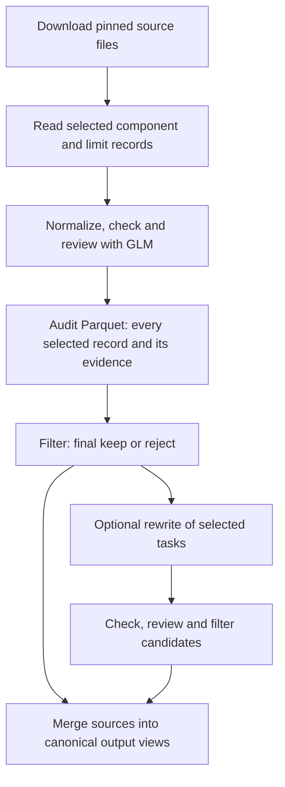

# Task curation experiments

This experiment turns pinned dataset sources into audited tasks and filtered
Parquet outputs. It chooses sources, download revisions, inference clients and
execution resources; reusable conversion policies live in
[TaskCompendium](../../../lib/taskcompendium/src/taskcompendium/pipeline/README.md).
GLM is the model used for rubric-based quality review. Filtering writes a new
artifact with a complete audit view containing final decisions and a separate
accepted-task view.



Start with the graph in [pipeline.py](pipeline.py). Source bindings pair a
library `TaskPipeline` (normalization, checks and rubric) with pinned inputs and
intended use in a `DatasetRecipe`. [nemotron.py](nemotron.py) demonstrates several
sources sharing family policies; [direct_sources.py](direct_sources.py) covers
individual datasets. Group sources that share a conversion contract.

For a new source, inspect its schema, reuse or extend a family policy, and add its
binding. Exercise it through the same graph with `--limit 10`; inspect both
accepted and rejected audit rows before increasing the run size. Downloads happen
before the limit, which uses `reshard(1).take_per_shard(N).reshard(64)`.

From the repository root, print a ten-record plan:

```bash
uv run --with './lib/taskcompendium[pipeline]' python -m \
  experiments.post_training.task_curation.pipeline \
  --source math500 --limit 10 --model-revision YOUR_GLM_REVISION
```

This is a dry run. See the [task curation reference](../../../docs/references/task-curation.md)
for execution flags, credentials, output views and cache behavior.
