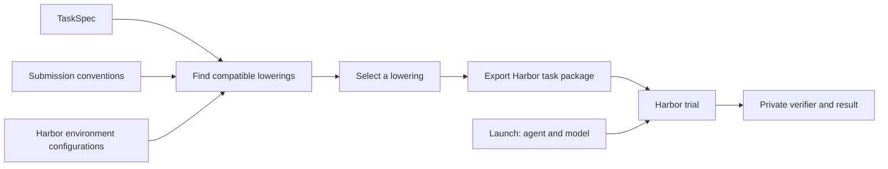

# TaskCompendium

The [task curation pipeline](../../docs/references/task-curation.md) downloads pinned sources, normalizes tasks, runs grading checks and GLM review, then writes final filtering decisions to sharded Parquet. Its audit retains every selected input, source locator, edit and rejection reason. Library families define normalization, checks and rubrics; the experiment binds pinned inputs, intended use, download artifacts and inference clients.

For ingestion work, start with the [pipeline overview](src/taskcompendium/pipeline/README.md)
and the [experiment flow](../../experiments/post_training/task_curation/README.md).
The sections below describe the task model and its presentation and grading contracts.

## What problem does it solve?

Training and evaluation tasks arrive with different prompt formats, answer rules, tools, and graders. TaskCompendium separates the problem a model must solve from the way a framework runs and grades it. A caller can choose among compatible presentations of a task while keeping its reference answer private. Additional Harbor environment configurations can use the same task definition.

The current implementation exports Harbor tasks for final text, number, and native-action results. It grades them through the shared verifier library after extracting the submission. The complete semantic schema also represents files, workspace state, arbitrary environment state, pinned images, initial workspaces, tool providers, and private resources. Their execution requires additional runtimes; direct chat rejects their requirements before export or launch.

## What does it contain?

- **Task specs** describe the source problem, the required capabilities, the kind of result, and how to verify it.
- **Submission conventions** describe how to ask for and extract a result, such as a plain answer, a JSON object, or a final function call.
- **Harbor environment configurations** describe the capabilities and tools exposed during execution. The only configuration in the current implementation is direct chat, which records submission calls but does not execute tools.
- **Lowering tools** find compatible convention and environment configuration pairs, select a pair, and export a runnable Harbor task package.
- **A Harbor adapter** runs the exported task against an OpenAI-compatible chat endpoint and records a grading result. Harbor acts as the harness: it orchestrates the model and environment after lowering.



## What is a task spec?

`TaskSpec` is the private definition of one source task. An importer or author creates it before choosing a submission convention or a framework launch.

| Field | Meaning |
| --- | --- |
| `id` | Stable identity for this task. |
| `context` | The ordered model-visible conversation: text messages, historical assistant function calls, and tool results. |
| `environment_requirements` | Required capabilities, pinned initial workspace, and named tool-provider contracts. |
| `final_tools` | An ordered list of functions that terminate a chat. They are not backed by a tool provider. |
| `interaction_tools` | Executable function declarations used by the optional episode runtime. |
| `output_paths` | Absolute output paths captured by the optional episode runtime. |
| `answer_type` | The semantic result: `text`, `number`, `file`, `state`, `workspace_state`, or `native_action`. |
| `source` | Upstream dataset, revision, row, and importer revision retained as audit provenance. |
| `verifier` | Private grading rule and configuration. See [What is a verifier?](#what-is-a-verifier) |
| `schema_version` | Version of the serialized spec: `0.21`. Readers reject other versions. |
| `resources` | Inline files grouped under `all`, `worker`, `oracle`, and `verifier` visibility. |
| `tags` | Arbitrary descriptive strings, retained in order, including duplicates and empty strings. |

A task has one final result. Ordered steps and reward aggregation are deferred.

`context.events` is the model-visible conversation prefix. A text event retains its role and content. Historical assistant calls and tool results retain their call IDs and order; the adapter sends them as OpenAI-compatible chat messages without executing them again. `answer_type` does not prescribe a wrapper such as JSON.

`ConversationInput` is not a lossless Responses API transcript. It excludes provider reasoning items. The NeMo importer omits an unencrypted historical reasoning summary only when a visible assistant message or function call follows it. It rejects encrypted reasoning and reasoning left at the decision point. Exact provider continuation from reasoning state is outside this contract.

For example, a task asking “What is 7 + 5?” can have `answer_type=number` and a private expected answer of `12`. The plain, JSON, and `answer_call` conventions carry that answer as `12`, `{"answer":"12"}`, and a final `submit_answer({"answer":"12"})` call, respectively. Each extracts a string for the same numeric verifier, which accepts both `12` and `12.0`. A task asking for a function call has `answer_type=native_action`; its context retains the conversation and its tools describe the source functions. The verifier and expected answer are never added to the model-visible input. Importers must make source output instructions neutral to the supported conventions, or reject rows they cannot safely rewrite. A raw-output requirement in a source message would conflict with a JSON or function-call convention; `answer_type=text` alone cannot detect that conflict in prose.

## What can a task represent?

### Text answers

A text task uses `answer_type=text`. Plain text, a JSON object with an `answer` string, and `submit_answer(answer: string)` can carry its answer. The `exact` verifier compares normalized text; `mcq` grades a single option letter. The same verifier grades the extracted answer across these conventions.

### Numeric answers

A numeric task uses `answer_type=number` and can use the same submission conventions as text. The `numeric` verifier parses the extracted string as a number and applies the explicitly configured absolute and relative tolerances. For example, both `12` and `12.0` can satisfy an expected value of `12.0`.

### Final function calls

A task whose result is a function call uses `answer_type=native_action`. Its `final_tools` field declares the available functions. `FinalAction` defines whether a call is required and the maximum call count. The final-action submission convention captures the assistant's calls, and `predicted_action` compares their function names and decoded argument objects with the private expected calls. Direct chat stops after recording the response; it does not execute the calls.

With the `answer_call` convention, the chat agent adds `submit_answer(answer: string)` alongside the task’s final tools and records the assistant's final response. It never invokes the function. The convention extracts the call's `answer` argument and passes it to the task's ordinary verifier. A non-call response or a call to another function receives `extraction_error` with no reward. The same final-action decoder handles native-action tasks; their verifier compares the recorded call's function name and argument dictionary with the private expected call.

### Files and state

`answer_type=file` names a file result. `answer_type=workspace_state` names the final filesystem workspace. `answer_type=state` names arbitrary resulting environment state, including provider state outside a filesystem. Exporting and running these results requires environment configurations and submission conventions that are not implemented here. The schema names `structured_exact` for a future JSON-value scorer; this package does not implement that scorer or state acquisition.

Public expectations belong in `context`: for example, the columns a CSV must contain or the behavior a repaired project must provide. The private verifier checks those expectations. A submission convention chooses how the result is delivered and extracted. `answer_type` identifies its semantic kind. TaskSpec has no extra intrinsic encoding or answer-format field.

## Environment requirements

`environment_requirements` declares the initial state and operations needed to solve a task.

| Field | Meaning |
| --- | --- |
| `capabilities` | Unique operation names, such as `shell`, `network`, `filesystem`, `process`, or `browser`. Names are open so future capabilities can be represented. |
| `docker_image` | Optional immutable image reference, such as `registry/project@sha256:<64 lowercase hex digits>`. Tags alone are rejected. |
| `working_directory` | Optional normalized absolute POSIX path for the main workspace. Omission declares no required working directory. |
| `setup_commands` | Ordered commands required to establish the initial workspace. |
| `environment_variables` | String values required in the worker or private verifier environment during task execution. |
| `tool_providers` | Mapping from a task-local provider instance name to a required action interface and initial state. |

Each `ProviderRequirement` contains `action_interface`, a versioned contract name such as `workplace:v1`, and required `initial_state`, a JSON value such as a string, null, or an object. Two named instances can require the same interface with different initial states. No digest is required. The selected runtime owns provider implementation, transport, state initialization, reset, and tool execution. `final_tools` contains only ordered function definitions advertised at the final decision point; it supplies no implementation.

The task's `docker_image` and worker file mounts describe worker initial state. A verifier declares its own capabilities, image, and workspace requirements in private `VerifierSpec.environment_requirements`. A future runtime must keep those requirements and private resources separate from the worker environment.

## Resource mounts

`resources` is a `ResourceGroups` object. Each group contains an ordered list of `TaskResource` mounts.

| Group | Visibility |
| --- | --- |
| `all` | Shared inputs visible to the worker, oracle, and verifier. |
| `worker` | Model-visible inputs. |
| `oracle` | Private reference material. |
| `verifier` | Private evaluation inputs. The verifier is the task's evaluator. |

Private gold and hidden tests belong in `oracle` or `verifier`. An `all` resource is model-visible. A role receives `all` followed by its own mounts in its runtime-owned workspace root. Destinations must be distinct in that combined sequence, including case-folded collisions and file/directory ancestor collisions. Separate role-specific groups can reuse a relative path without sharing their content.

Oracle resources are reserved for trusted reference-solution generation. Verifier resources are used when evaluating a candidate result. These groups declare access; they do not require an oracle or evaluator process to run.

The worker mount root is `environment_requirements.working_directory` when declared; otherwise the selected runtime supplies it. For example, a resource at `project/input.txt` with a working directory of `/app` appears at `/app/project/input.txt`. Worker mounts are established before setup commands run in that working directory. Oracle and verifier mounts use separate private roots supplied by their runtimes.

Each `TaskResource` contains one inline file, with these fields:

| Field | Meaning |
| --- | --- |
| `path` | Normalized relative destination under each receiving role's runtime-owned workspace root. |
| `source` | An `InlineFile` containing the exact file bytes, encoded as canonical base64. |
| `mode` | Optional Unix permission mode as a three- or four-digit octal string, such as `0644` or `0755`. An explicit mode applies to the mounted file. Files default to `0644` when the mode is omitted. |
| `mtime_ns` | Optional integer Unix modification timestamp in nanoseconds for the mounted file. Omission leaves the timestamp unspecified. |

`InlineFile` has `kind="inline_file"` and `content_base64`. UTF-8 text uses the same byte representation as binary files. Resource contents are stored in the task spec; no dataset root, process working directory, or exported package location is used to locate them. Shared external files are deferred until a `TaskSet` contract defines their location and loading.

An archive can be included as ordinary file bytes, but resource mounting does not extract it. Paths may contain directories to locate the file within the workspace. Directory resources and recursive copies are unsupported. Schema decoding performs no filesystem inspection or I/O.

Grouped inline resources can contain:

```json
{
  "resources": {
    "all": [
      {
        "path": "README.txt",
        "source": {"kind": "inline_file", "content_base64": "VXNlIHRoZSBzdXBwbGllZCBwcm9qZWN0Lg=="},
        "mode": "0444",
        "mtime_ns": 1725555600000000000
      }
    ],
    "worker": [
      {"path": "project/input.txt", "source": {"kind": "inline_file", "content_base64": "cHVibGljIGlucHV0"}}
    ],
    "oracle": [
      {"path": "answer.txt", "source": {"kind": "inline_file", "content_base64": "cHJpdmF0ZSByZWZlcmVuY2U="}}
    ],
    "verifier": [
      {"path": "checks/grade.py", "source": {"kind": "inline_file", "content_base64": "cHJpdmF0ZSBjaGVja3M="}}
    ]
  }
}
```

File materializers must reject unsafe destinations and collisions, and enforce byte limits. No resource materializer is implemented here. Direct chat rejects every nonempty resource group before writing a task package.

## What can we import?

### TaskTrove MCQA

The TaskTrove MCQA importer reads archives from a cleaned release. See the [published TaskTrove Clean dataset](https://huggingface.co/datasets/open-athena/task-trove). Its caller passes the archive bytes, upstream subset, archive path, and release provenance to `read_archive`. The reader checks the subset and path against the archive manifest; the release URI and revision are caller-supplied provenance. The importer checks the source answer-line template before replacing it with a one-letter instruction. Its text answer works with plain and JSON submission conventions. The private `mcq` verifier stores the expected letter and option count. Any author can use that verifier; it currently calls the shared `verifyit` MCQ scorer after extracting the submission. This importer supports only MCQ mode. Executable TaskTrove modes still need private resources and an isolated verifier runtime.

### NeMo predicted function calls

`taskcompendium.importers.nemo_predicted_action.import_row` accepts a NeMo predicted-function-call row and a caller-pinned digest of that row. `canonical_sha256(row)` hashes its UTF-8 JSON with sorted keys and compact separators; record the digest with the source revision before importing. The importer returns `(specification, convention)`, with `answer_type=native_action` and a `FinalAction` convention. A hand-authored task can select the same convention with `FinalAction(id="final-call")`. The context carries the source conversation; `final_tools` carries advertised functions. `FinalAction.require_call` and `FinalAction.max_calls` carry the source call constraints. The convention describes how Harbor captures the final action and can be reused across tasks. The expected function calls remain in the private `predicted_action` verifier. There is one stored conversation, with no second flattened prompt to keep in sync.

For a chat launch, the Harbor adapter sends the source turns and function definitions to the model, records its final function call, and stops without dispatching the call. The verifier compares function names and JSON arguments. The importer rejects rows whose expected action is an assistant text message because the source comparator gives any message full credit; it also rejects request settings it cannot carry. The pinned fixture records the NeMo Gym repository revision and blob SHA in `tests/fixtures/nemo/predicted-action.provenance.json`. Numeric tolerance is used only when explicitly set in the private verifier.

## What is a verifier?

Each spec selects a private verifier and stores its configuration in `VerifierSpec`. TaskCompendium uses the submission convention to extract a candidate answer; the selected verifier grades it. `answer_type` controls which submission conventions can carry the result; the verifier determines how to score it.

`VerifierSpec.kind` is an open nonempty string. Its private typed `environment_requirements` defaults to empty and declares the capabilities, image, and workspace needed by the verifier. The harness owns these requirements. `parameters_json` is an opaque private JSON object owned by the shared verifier library (`verifyit`); the harness must not extract structural environment fields such as an image from it.

`verifier` grades one acquired answer. Comparative scoring across several attempts, cohort membership, and grading phase belong to the trainer. The ordinary per-attempt grader can score an already acquired answer regardless of worker workspace requirements.

Schema loading accepts descriptors independently of execution. Grading parses standard VerifyIT specifications; no TaskCompendium verifier registry exists. Direct chat supports answer-file graders and trusted recipe-owned scripts with private fixtures. Candidate-executing graders require a pinned isolated grading image. Unsupported environment requirements remain explicit errors.

Conversion pipelines use `grader_package(spec, resources)` for standard graders or `script_package(script, config)` for task-specific policy. The returned descriptor goes in `task.verifier`; files go in `task.resources.verifier` relative to the private tests root. Scripts use VerifyIT's structured verdict contract and need no central registration. Exact, numeric, MCQ and final-action grading retain their pure candidate path; other supported modes consume file evidence.

VerifyIT owns reusable comparison, validation and execution components. Recipe families own special parsing, source-specific reward rules and private evaluator data. Grader scripts are embedded in emitted tasks and can run independently of the converter. `grade_task` extracts submissions and captured runtime evidence, runs the package and preserves scored, invalid-task and infrastructure outcomes.


## What is a lowering?

A lowering is one runnable presentation of a spec for a target framework. It combines a compatible submission convention with a Harbor environment configuration, then writes the target's task files. The spec says *what* result is needed; the convention says *how* the model delivers it; the environment configuration says *which capabilities* the environment provides. Agent and model selection happens when the task is launched.

`convention.supports(spec.answer_type)` checks the result kind. `compatible_lowerings` uses that check and the environment requirements; it does not read convention IDs from the spec. The direct-chat environment configuration accepts only tasks with no worker or verifier environment capabilities, images, workspace initialization, tool providers, or resources; a task requiring `shell` has no candidate in the current implementation. File, workspace-state, arbitrary-state, and unimplemented-verifier tasks also have no direct-chat candidate. Export and launch raise `NotImplementedError` for these requirements before producing artifacts or requesting a model response. Chat request construction also rejects unsupported environment and resource requirements. `select_lowerings` can keep all candidates, take the first, or sample one with an explicit RNG key. The order of the caller-supplied convention and environment configuration sequences determines the first candidate and the sample order. A training caller should record those ordered inputs, the selection policy and key, and the TaskCompendium code revision.

Submission conventions preserve the task’s advertised functions. Plain-text and JSON submissions keep those functions; the `answer_call` convention adds `submit_answer` and requires one call with an answer string. An existing function named `submit_answer` conflicts with that convention and is rejected. `FinalAction(require_call=True)` requests a call, and `FinalAction(max_calls=1)` disables parallel calls. Before scoring, the grading boundary rejects missing required calls or calls exceeding `max_calls` as `extraction_error` with no reward. Direct chat captures the final assistant turn without executing advertised functions.

An author can require a particular execution environment without changing the semantic `TaskSpec`. Pass `required_environment="shellsim"` to `select_lowerings`; it keeps only ShellSim candidates and raises if none are compatible. A `shell` capability requests an operation, while ShellSim names a concrete execution choice. The current implementation offers only direct chat, so a ShellSim request fails rather than falling back to chat. The selected environment configuration is recorded in the exported Harbor package.

```python
from pathlib import Path

from taskcompendium.lowering import (
    HarborEnvironmentConfig,
    SelectionPolicy,
    compatible_lowerings,
    lower_to_harbor,
    select_lowerings,
)
from taskcompendium.grading import numeric_answer
from taskcompendium.models import AnswerType, ConversationInput, EnvironmentRequirements, Source, TaskSpec, TextMessage
from taskcompendium.submission import AnswerFormat, SubmissionConvention

spec = TaskSpec(
    id="arithmetic-7-plus-5",
    context=ConversationInput(events=(TextMessage(role="user", content="What is 7 + 5?"),)),
    environment_requirements=EnvironmentRequirements(),
    answer_type=AnswerType.NUMBER,
    verifier=numeric_answer(12.0, tolerance_abs=0.0, tolerance_rel=0.0),
    source=Source(dataset="hand-authored", revision="2026-09-16", row="arithmetic-7-plus-5", importer_revision="1"),
)
conventions = (
    SubmissionConvention(id="plain", answer_format=AnswerFormat.PLAIN),
    SubmissionConvention(id="json", answer_format=AnswerFormat.JSON),
    SubmissionConvention(id="answer-call", answer_format=AnswerFormat.ANSWER_CALL),
)
candidates = compatible_lowerings(spec, conventions, (HarborEnvironmentConfig(),))
chosen = select_lowerings(candidates, SelectionPolicy.SAMPLE, rng_key=1234)[0]
lower_to_harbor(spec, chosen.convention, chosen.environment_config, Path("/tmp/arithmetic-task"))
```

## Dataset conversion

TaskSpec defines the serialized task contract. Dataset conversion pipelines own
storage layout and streaming I/O, using Zephyr for Parquet processing. The
TaskCompendium package has no Parquet reader or writer. JSON decoding preserves
valid unsupported requirements; export and launch validate runtime support
separately.

## How does Harbor run it?

`lower_to_harbor` writes `instruction.md` and `task.toml` for Harbor, plus `specification.json`, `submission_convention.json`, and `environment_config.json` for the launcher and custom verifier. The package also has an empty `environment/` directory. A chat launch sends the structured conversation from the spec, then adds the convention's final answer instruction when needed. The agent has no tool to read the package files. Harbor's custom verifier can read the spec and private reference answer. The convention file tells it how to extract the submitted answer.

`run_trial` takes the exported directory, its environment configuration, and a chat launch. The Harbor harness selects and runs the agent and environment; those choices are absent from `TaskSpec`. Provide the endpoint's base URL and, if needed, the name of an environment variable containing the API key. The agent resolves that variable in its process; the trial configuration retains only its name.

```python
import asyncio

from taskcompendium.harbor.runner import ChatLaunch, run_trial

result = asyncio.run(
    run_trial(
        Path("/tmp/arithmetic-task"),
        chosen.environment_config,
        ChatLaunch(model="model-id", api_base="https://example.com/v1", api_key_env="MODEL_API_KEY"),
        Path("/tmp/arithmetic-trials"),
        "arithmetic-run",
    )
)
```

Each direct-chat Harbor trial runs one `ChatAgent` using the exported submission convention. The lowering prepares the conversation and tool configuration; the agent makes one request, validates the chat protocol, and writes a typed `ConversationTrace` to `submission.json`. This trace contains the complete model-visible conversation, including submission instructions and the final assistant message. Function-call arguments are decoded objects in both source context and grading evidence. The raw provider response is retained separately in `chat-response.json` for diagnostics.

The direct-chat environment exposes no filesystem or shell tools. Harbor's custom verifier reads the typed trace and calls the synchronous `grade_answer` submission adapter. TaskCompendium extracts text or numeric candidates according to the convention and passes final function calls directly to shared scoring. Expected values stay in private verifier configuration. Each harness translates its protocol into the shared conversation types.

A valid but wrong answer receives reward `0.0`. A text, numeric, or final-action answer that violates its submission convention receives `extraction_error` with no reward. A native-action submission that satisfies its convention but differs from the expected function calls receives reward `0.0`. A malformed provider message or tool-call argument fails at the harness boundary with no reward and the raw response retained. Verifier infrastructure failures are recorded as `infra_error` with no reward in `taskcompendium-result.json`. The package requires Harbor's [custom-verifier task loading](https://github.com/marin-community/harbor/pull/155) and does not use `tests/test.sh`. Install the pinned Harbor fork with `uv sync --project lib/taskcompendium --extra harbor`; its revision is declared in `lib/taskcompendium/pyproject.toml`.

The package tests use a test-only `ReplayAgent` in `tests/harbor_replay.py` to write fixed assistant messages and exercise Harbor grading without a model request. They also replay responses at the HTTP boundary through the production launcher. Replay is absent from the installed package and public launcher.

TaskCompendium requires Python 3.12 or 3.13 and uses `marin-rigging` for shared portable path and mount-collision validation. The validator leaf module performs no storage access.

Run the package tests from the repository root:

```bash
uv run --project lib/taskcompendium --extra harbor --group test pytest lib/taskcompendium/tests -q

# Type-check the package from its own project directory after installing its dependencies.
cd lib/taskcompendium
uvx --from 'pyrefly>=1.0.0,<1.1.0' pyrefly check
```
